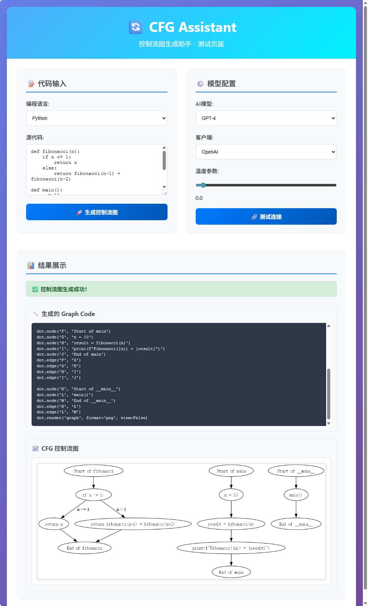

# 🔄 CFG Assistant - 控制流图生成助手

一个基于AI的智能控制流图(Control Flow Graph)生成工具，支持多种编程语言，能够自动分析代码结构并生成可视化的控制流图。


## 📋 项目简介

CFG Assistant 是一个现代化的Web应用程序，利用大型语言模型(LLM)技术自动分析代码并生成对应的控制流图。该项目采用前后端分离架构，提供RESTful API和直观的用户界面。

### ✨ 主要特性

- **🎯 多语言支持**: Python、Java、C语言
- **🤖 AI驱动**: 基于GPT和DeepSeek模型
- **📊 可视化**: 自动生成PNG格式的控制流图
- **⚡ 现代化**: FastAPI后端 + Vue3前端
- **🔧 可配置**: 支持多种AI模型和参数调整
- **📱 响应式**: 适配各种设备屏幕

## 🚀 快速开始

### 📦 环境要求

- **Python**: 3.8 或更高版本（推荐使用Anaconda管理）
- **Anaconda**: 用于Python环境和包管理
- **Node.js**: 16.x 或更高版本
- **Git**: 用于克隆项目

### 🔧 安装步骤

#### 1. 克隆项目

```bash
git clone https://github.com/your-username/CFG_Assistant.git
cd CFG_Assistant
```

#### 2. 后端环境配置（使用Anaconda）

本项目推荐使用 **Anaconda** 进行Python环境管理：

```bash
# 进入后端目录
cd backend

# 创建conda环境（推荐）
conda create -n CFG_Generator python=3.8

# 激活conda环境
conda activate CFG_Generator

# 安装依赖
pip install -r requirements.txt
```

#### 3. 配置API密钥

**⚠️ 重要：必须配置API密钥才能使用AI功能！**

在项目根目录下编辑 `config.yaml` 文件：

```yaml
API Key:
  openai: "your_openai_api_key_here"      # 替换为您的OpenAI API密钥
  deepseek: "your_deepseek_api_key_here"  # 替换为您的DeepSeek API密钥
```

**🔑 获取API密钥：**

1. **OpenAI API密钥**：
   - 访问 [OpenAI官网](https://platform.openai.com/api-keys)
   - 注册账户并创建API密钥
   - 新用户通常有免费试用额度

2. **DeepSeek API密钥**（可选）：
   - 访问 [DeepSeek官网](https://platform.deepseek.com/api-keys)
   - 注册账户并获取API密钥

#### 4. 配置环境变量（可选）

如果需要自定义服务器配置，在 `backend` 目录下创建 `.env` 文件：

```env
# 服务器配置
HOST=127.0.0.1
PORT=8000
DEBUG=true
```

#### 5. 启动后端服务

```bash
# 启动开发服务器
uvicorn main:app --reload --port 8000

# 或使用脚本启动
cd backend
python main.py
```

#### 6. 前端环境配置

```bash
# 进入前端目录
cd frontend

# 安装依赖
npm install

# 启动开发服务器
npm run dev
```

#### 7. 访问应用

- **前端界面**: http://localhost:5173 
- **后端API文档**: http://localhost:8000/docs
- **健康检查**: http://localhost:8000/health

## 📖 使用说明

### 🎯 基本用法

**⚠️ 使用前请确保已正确配置API密钥！**

1. **打开前端界面**: 访问 `http://localhost:5173` （自动跳转到主界面）
2. **输入代码**: 在代码编辑器中粘贴您的代码
3. **选择语言**: 选择对应的编程语言（Python/Java/C）
4. **配置模型**: 选择合适的AI模型和参数
5. **生成图表**: 点击"生成控制流图"按钮
6. **查看结果**: 查看生成的图形代码和可视化图片

**输入测试代码：**

```java
public static void heapsort(int[] a) {
    for (int i = 0; i < a.length; i++) {
        for (int j = i * 3 + 1; j < i * 3 + 4; j++) {
            if (j < a.length) {
                if (a[j] < a[i]) {
                    switchPos(a, i, j);
                    heapsort(a);
                }
            }
        }
    }
}
```

**效果显示：**



### 🔧 高级配置

#### 支持的AI模型

- **OpenAI系列**: GPT-4, GPT-4 Turbo, GPT-3.5 Turbo
- **DeepSeek系列**: DeepSeek Chat

#### 可调参数

- **温度参数**: 0.0-2.0，控制生成结果的随机性
- **最大令牌数**: 控制生成内容的长度
- **客户端选择**: OpenAI或DeepSeek

### 📊 API使用

#### 生成控制流图

```bash
curl -X POST "http://localhost:8000/api/cfg/generate" \
  -H "Content-Type: application/json" \
  -d '{
    "code": "def hello():\\n    print(\\"Hello World\\")",
    "language": "Python",
    "model_name": "gpt-3.5-turbo",
    "client_name": "openai",
    "temperature": 0.0
  }'
```

## 🏗️ 项目架构

### 📁 目录结构

```
CFG_Assistant/
├── backend/                    # FastAPI后端
│   ├── api/                   # API路由
│   │   └── routes.py          # 主要路由定义
│   ├── core/                  # 核心配置
│   │   └── config.py          # 应用配置
│   ├── models/                # 数据模型
│   │   └── schemas.py         # Pydantic模型
│   ├── services/              # 业务逻辑
│   │   ├── CFG_Generation.py  # CFG生成核心
│   │   └── cfg_service.py     # CFG服务
│   ├── static/                # 静态文件
│   │   └── cfg_*.png          # 生成的CFG图片
│   ├── uploads/               # 上传文件
│   ├── main.py                # 应用入口
│   └── requirements.txt       # Python依赖
├── frontend/                  # Vue3前端
│   ├── src/
│   │   ├── components/        # Vue组件
│   │   ├── views/             # 页面视图
│   │   ├── api/               # API调用
│   │   ├── router/            # 路由配置
│   │   └── stores/            # 状态管理
│   ├── package.json           # Node.js依赖
│   └── vite.config.ts         # Vite配置
├── prompt/                    # AI提示词
│   ├── Python/               # Python专用提示词
│   ├── Java/                 # Java专用提示词
│   └── C/                    # C语言专用提示词
├── util/                     # 工具函数
│   └── LLM_util.py           # LLM工具类
├── config.yaml               # 配置文件
└── README.md                 # 项目文档
```

