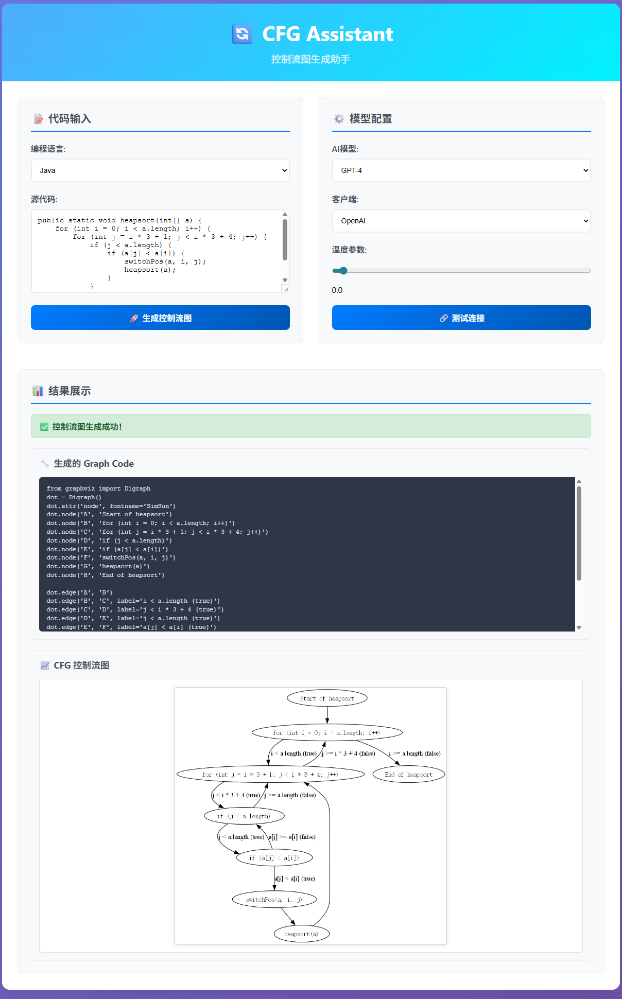

# 🔄 CFG Assistant - Control Flow Graph Generation Agent


## 📋 Project Overview

CFG Assistant is a modern web application that utilizes Large Language Model (LLM) technology to automatically analyze code and generate corresponding control flow graphs. 

### ✨ Key Features

- **🎯 Multi-language Support**: Python, Java, C Language
- **📊 Visualization**: Automatically generates PNG format control flow graphs
- **⚡ Modern**: FastAPI backend + Vue3 frontend
- **🔧 Configurable**: Supports multiple AI models and parameter adjustments

## 🚀 Quick Start

### 📦 Environment Requirements

- **Python**: 3.8 or higher (Recommended to use Anaconda for management)
- **Anaconda**: For Python environment and package management
- **Node.js**: 16.x or higher
- **Git**: For cloning the project

### 🔧 Installation Steps

#### 1. Clone Project

```bash
git clone https://github.com/Zou-code/CFG-Assistant.git
cd CFG_Assistant
```

#### 2. Backend Environment Configuration (Using Anaconda)

This project recommends using **Anaconda** for Python environment management:

```bash
# Enter backend directory
cd backend

# Create conda environment (recommended)
conda create -n CFG_Generator python=3.8

# Activate conda environment
conda activate CFG_Generator

# Install dependencies
pip install -r requirements.txt
```

#### 3. Configure API Keys

**⚠️ Important: API keys must be configured to use AI features!**

Edit the `config.yaml` file in the project root directory:

```yaml
API Key:
  openai: "your_openai_api_key_here"      # Replace with your OpenAI API key
  deepseek: "your_deepseek_api_key_here"  # Replace with your DeepSeek API key
```

**🔑 Getting API Keys:**

1. **OpenAI API Key**:
   - Visit [OpenAI Official Website](https://platform.openai.com/api-keys)
   - Register an account and create an API key
2. **DeepSeek API Key** (optional):
   - Visit [DeepSeek Official Website](https://platform.deepseek.com/api-keys)
   - Register an account and get an API key

#### 4. Configure Environment Variables (Optional)

If you need to customize server configuration, create a `.env` file in the `backend` directory:

```env
# Server configuration
HOST=127.0.0.1
PORT=8000
DEBUG=true
```

#### 5. Start Backend Service

```bash
# Start development server
uvicorn main:app --reload --port 8000

# Or start with script
cd backend
python main.py
```

#### 6. Frontend Environment Configuration

```bash
# Enter frontend directory
cd frontend

# Install dependencies
npm install

# Start development server
npm run dev
```

#### 7. Access Application

- **Frontend Interface**: http://localhost:5173
- **Backend API Documentation**: http://localhost:8000/docs
- **Health Check**: http://localhost:8000/health

## 📖 Usage Instructions

### 🎯 Basic Usage

**⚠️ Please ensure API keys are properly configured before use!**

1. **Open Frontend Interface**: Visit `http://localhost:5173` (automatically jumps to main interface)
2. **Input Code**: Paste your code in the code editor
3. **Select Language**: Choose the corresponding programming language (Python/Java/C)
4. **Configure Model**: Select appropriate AI model and parameters
5. **Generate Graph**: Click "Generate Control Flow Graph" button
6. **View Results**: View generated graph code and visualization image

**Input Test Code:**

```java
public static void heapsort(int[] a) {
    for (int i = 0; i < a.length; i++) {
        for (int j = i * 3 + 1; j < i * 3 + 4; j++) {
            if (j < a.length) {
                if (a[j] < a[i]) {
                    switchPos(a, i, j);
                    heapsort(a);
                }
            }
        }
    }
}
```

**Effect Display:**



### 🔧 Advanced Configuration

#### Supported AI Models

- **OpenAI Series**: GPT-4, GPT-4 Turbo, GPT-3.5 Turbo
- **DeepSeek Series**: DeepSeek Chat

#### Adjustable Parameters

- **Temperature Parameter**: controls randomness of generated results
- **Maximum Tokens**: Controls length of generated content
- **Client Selection**: OpenAI or DeepSeek

### 📊 API Usage

#### Generate Control Flow Graph

```bash
curl -X POST "http://localhost:8000/api/cfg/generate" \
  -H "Content-Type: application/json" \
  -d '{
    "code": "def hello():\\n    print(\\"Hello World\\")",
    "language": "Python",
    "model_name": "gpt-3.5-turbo",
    "client_name": "openai",
    "temperature": 0.0
  }'
```

## 🏗️ Project Architecture

### 📁 Directory Structure

```
CFG_Assistant/
├── backend/                    # FastAPI backend
│   ├── api/                   # API routes
│   │   └── routes.py          # Main route definitions
│   ├── core/                  # Core configuration
│   │   └── config.py          # Application configuration
│   ├── models/                # Data models
│   │   └── schemas.py         # Pydantic models
│   ├── services/              # Business logic
│   │   ├── CFG_Generation.py  # CFG generation core
│   │   └── cfg_service.py     # CFG service
│   ├── static/                # Static files
│   │   └── cfg_*.png          # Generated CFG images
│   ├── uploads/               # Upload files
│   ├── main.py                # Application entry
│   └── requirements.txt       # Python dependencies
├── frontend/                  # Vue3 frontend
│   ├── src/
│   │   ├── components/        # Vue components
│   │   ├── views/             # Page views
│   │   ├── api/               # API calls
│   │   ├── router/            # Route configuration
│   │   └── stores/            # State management
│   ├── package.json           # Node.js dependencies
│   └── vite.config.ts         # Vite configuration
├── prompt/                    # AI prompts
│   ├── Python/               # Python-specific prompts
│   ├── Java/                 # Java-specific prompts
│   └── C/                    # C language-specific prompts
├── util/                     # Utility functions
│   └── LLM_util.py           # LLM utility class
├── config.yaml               # Configuration file
└── README.md                 # Project documentation
```
